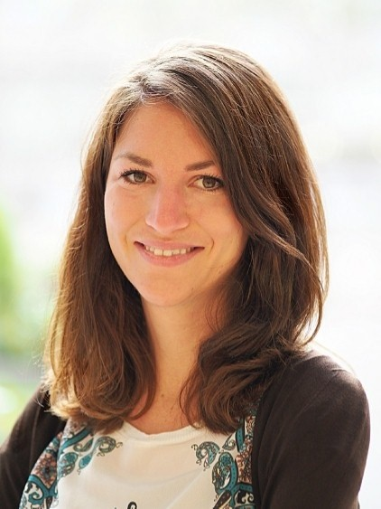

<!-- 

# **Über mich / Inhalt dieser Website**

Auf dieser Seite möchte ich R-Code zu verschiedenen Themen sammeln, mit denen ich mich im Laufe der Zeit beschäftigt habe. In erster Linie habe ich diese Seite für mich als Themensammlung und Nachschlagwerk angelegt.

Es macht mir Spaß, R-Kenntnisse weiterzugeben. Daher freue ich mich wenn die Seite als Anregung bzw. Vorlage genutzt wird und lade Euch daher herzlich zum Stöbern ein. Die Inhalte möchte ich regelmäßig aktualisieren und erweitern.

Lena Vogl

